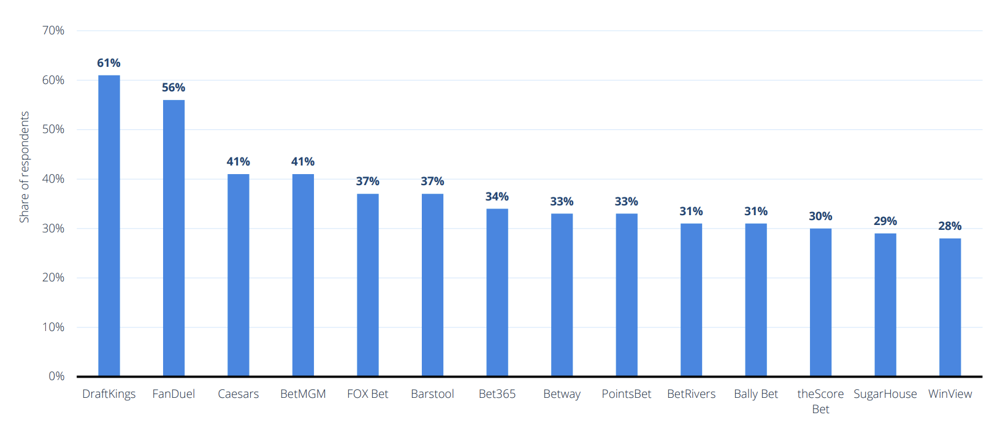

<section>
    <div id="title">
    <video src="./assets/represent2526-hero.mp4" autoplay muted loop playsinline></video>
        <div id="title-text">
            <h1 style="font-size: 64px;">The Rise of <span>Sports Betting</span></h1>
            <h2>Analyzing a Culture Shift in Gambling</h2>
            <h2>IAT 355</h2>
        </div>
    </div>
</section>

```js
    const us = await d3.json("https://vega.github.io/vega-datasets/data/us-10m.json");

    const states = topojson.feature(us, us.objects.states).features;

    const legality = await FileAttachment("./csv_Files/legalityPerStates.csv").csv();
    const transformedData = legality.map(d => ({
        FIPS: +d.FIPS,
        States: d.States,
        Legality: d.Legality
    }));

    const lookup = new Map(transformedData.map(d => [d.FIPS, d]));

    const mapData = states.map(f => {
        const row = lookup.get(f.id);
        return {
        ...f,
        States: row?.States ?? "Unknown",
        Legality: row?.Legality ?? "Unknown"
        };
    });
```

```js
const stateFilterInput = Inputs.select(["All", "Illegal", "Retail only", "Online only", "Legal"],
{label: "Filter by legality", value: "All"});

const stateFilter = Generators.input(stateFilterInput);

let filteredData = stateFilter === "All"
  ? mapData
  : mapData.filter(d => d.Legality === stateFilter)
```

```js
function mapPlot({width}) {
    return Plot.plot({
        projection: "albers-usa",
        title: "Explore the Legality of Sports Betting across U.S. States",
        width,
        height: 600,
        color: {
            type: "ordinal",
            domain: ["Illegal", "Retail only", "Online only", "Legal"],
            range: ["#d73027", "#b7d9edff", "#6ba2c4ff", "#07588eff"],
            legend: true,
            label: "Sports betting status (2025)",
        },
        marks: [
            Plot.geo(mapData, {
                fill: "Legality",
                stroke: "white",
                strokeWidth: 0.7,
                title: d => `${d.States}: ${d.Legality}`,
                opacity: d => stateFilter === "All" || d.Legality === stateFilter ? 1 : 0.25
            }),
            Plot.tip(mapData, Plot.geoCentroid({title: (d) => stateFilter === "All" || d.Legality === stateFilter ? d.States : undefined, anchor: "bottom", textPadding: 3}))
        ]
    });
}
```

<section id="history">
    <p>Sports betting has shifted from a niche activity to a mainstream feature of American sports culture. Fans no longer just watch games, they place wagers through mobile apps, track odds in real time, and see betting promotions during live broadcasts. This rapid growth has been driven by changes in U.S. law, aggressive marketing from sportsbooks, and the convenience of online platforms. At the same time, it has raised serious questions about regulation and who really benefits financially. We will explore how sports betting became legal, how popular it has become, which platforms dominate the market, and what risks are hidden behind the excitement.</p>
    <h1>History of Sports Betting in the United States</h1>
    <!-- <h1>How Sports Betting Became Legal in the United States</h1>
    <div class="timeline">
        <div class="timeline-container left">
            <div class="content">
            <h3>January 1992</h3>
            <p>The Professional and Amateur Sports Protection Act of 1992 (PASPA) signed into law; sports betting becomes illegal in the U.S.</p>
            </div>
        </div>
        <div class="timeline-container right">
            <div class="content">
            <h3>November 2011</h3>
            <p>The Sports Betting Amendment is approved in New Jersey. The measure amends the state constitution to allow the legislature to legalize betting on the results of professional, college, and amateur sporting events. Governor Christie signs the bill on January 17, 2012.</p>
            </div>
        </div>
        <div class="timeline-container left">
            <div class="content">
            <h3>August 2012</h3>
            <p>The NCAA and four pro sports leagues (the NFL, NBA, NHL, and MLB) sue New Jersey to stop it from offering sports betting after the 2011 referendum, arguing that it violates federal law (i.e., PASPA). A string of court battles ensues.</p>
            </div>
        </div>
        <div class="timeline-container right">
            <div class="content">
            <h3>June 2017</h3>
            <p>The Supreme Court of the United States takes the case.</p>
            </div>
        </div>
        <div class="timeline-container left">
            <div class="content">
            <h3>December 2017</h3>
            <p> While New Jersey battles against PASPA, the sports leagues argue for the prohibition of gambling in the state to be upheld</p>
            </div>
        </div>
        <div class="timeline-container right">
            <div class="content">
            <h3>May 2018</h3>
            <p>The U.S. Supreme Court rules for New Jersey and strikes down PASPA; all states can now legalize sports betting.</p>
            </div>
        </div>
    </div> -->
    <div class="card grid grid-cols-1 grid-rows-4">
        <div class="grid-colspan-1 grid-rowspan-4">${
            resize((width) => mapPlot({width}))
        }</div>
        <h3>${stateFilterInput}</h3>
    </div>
    <div class="history-text">
        <h2>Different states, different regulations</h2>
        <p>Like many industries, going online looks to be the next step in the sports betting world. It allows consumers to place bets on sports in a convenient manner via a website or app. It is ultimately a more accessible way to wager money on sports than the land-based alternatives that bettors must attend in person. But not all states that have legalized sports betting have, or will, allow online or mobile wagering. Some states, like North Carolina, require all bets to be placed inside a casino. Meanwhile, states like New Jersey have legalized both land-based and online wagering. In September 2021, over 90 percent of sports bets in New Jersey were placed online.</p>
    </div>
</section>


```js
const searchData = await FileAttachment("./csv_Files/googleSearchTrendInUS.csv").csv();
```

```js
function searchTrend(data, {width}){
    const transformedData = data.map(d => ({
        ...d,
        Interest: +d["Sports betting: (United States)"],
        Date: new Date(d.Month)
    }));
    return Plot.plot({
        width,
        title: "Google Search trends for 'Sports Betting'",
        subtitle: "Searches from the past 2 decades",
        x: {
            label: "Year",
            type: "time"
        },
        y: {
            label: "Search Interest (0 - 100)"
        },
        marks: [
            Plot.lineY(transformedData, {
                x: "Date",
                y: "Interest",
                stroke: "steelblue",
                curve: "step",
                tip: true,
            }),

            Plot.linearRegressionY(transformedData, {
                x: "Date",
                y: "Interest",
                stroke: "orange",
            })
        ]
    });
}
```

<section id="trend">
    <h1>Is It Really That Popular?</h1>
    <p> Sports betting has steadily grown in public interest over the past two decades, and this trend is clearly reflected in the Google search data visualized above. The blue line shows how often people searched for “sports betting” over time, while the red regression line highlights the long-term direction of this activity. Despite short-term spikes around major sporting events, the upward slope of the regression line suggests a gradual and consistent increase in interest. In other words, people are searching for sports betting more frequently now than in previous years, reflecting broader cultural acceptance, expanding legalization across states, and rising accessibility through online platforms. </p>
    <div class="grid grid-cols-1">
    <div class="card">${
        resize((width) => searchTrend(searchData, {width}))    
    }</div>
    </div>
</section>

<section id="platforms">
    <h1>Comparing Platforms</h1>
    
    <h3>Where does the revenue go?</h3>
    <p>In the first 13 months of legalization, the largest cut of revenue was, unsurprisingly, retained by the sports betting operators. However, a few other groups also gain from legalization.</p>
    <p>There are varying state policies regarding the taxing of sports betting, meaning that some states are bringing in more tax revenue than others. With the development of these statespecific regulations and policies, the first year's sum of almost 70 million U.S. dollars looks set to grow in the future.</p>
    <p>Meanwhile, the federal government takes 0.25 percent of all sportsbook handles in the U.S., which may not sound like much, but it resulted in a payment of almost 25 million U.S. dollars between June 2018 and July 2019. This figure also stands to grow alongside the market.</p>
    <p>Lastly, the smallest cut went to the operator's tax obligations to cities, counties, horse racing purses, and other community investments.</p>
</section>


```js
const revenueDataset = await FileAttachment("./csv_Files/state_revenue7.csv").csv();
const transformedRevenueData = revenueDataset.map(d => ({
    ...d,
    Revenue: +d.Revenue,
    Date: new Date(d.Date)
}));
transformedRevenueData.sort((a, b) => a.Date - b.Date);

const stateRevenueTotals = d3.rollup(
    transformedRevenueData,
    v => d3.sum(v, d => d.Revenue),
    d => d.State
);

const [maxRevenueState, maxRevenue] = d3.greatest(
    stateRevenueTotals.entries(),
    ([state, revenue]) => revenue
)

const top5States = Array.from(stateRevenueTotals.entries())
  .sort((a, b) => d3.descending(a[1], b[1]))
  .slice(0, 5);

const highlightedStates = new Set(["New Jersey", "Nevada", "New York"]);
```

```js
function revenuePlot({width}) {
    return Plot.plot({
        title: "Sports Betting Revenue by State (2018-2022)",
        subtitle: "The sports betting ban was lifted in May 2018 by the U.S. Supreme Court, allowing each state to impose their own rules.",
        width,
        marginLeft: 80,
        color: {legend: true},
        x: {grid: true, label: "Year"},
        marks: [
            Plot.lineY(transformedRevenueData.filter((d) => !highlightedStates.has(d.State)), 
                {
                    x: "Date",
                    y: "Revenue",
                    z: "State",
                    stroke: "#7a7a7aff",
                    opacity: 0.5,
                    curve: "monotone-x",
                    markerEnd: true
                }
            ),
            Plot.lineY(transformedRevenueData.filter((d) => highlightedStates.has(d.State)), 
                {
                    x: "Date",
                    y: "Revenue",
                    stroke: "State",
                    tip: true,
                    curve: "monotone-x",
                    markerEnd: true
                }
            ),
            Plot.tip(
                [`Sports Betting is legalized in New Jersey. (June 2018)`],
                {x: new Date("2018-06-1"), y: 133, dy: 10, anchor: "top"}
            ),
            Plot.tip(
                [`The first online sports bet placed in New Jersey. (August 2018)`],
                {x: new Date("2018-08-1"), y: 133, dy: -120, anchor: "bottom"}
            ),
            Plot.tip(
                [`In-person sports betting is made legal in New York at specific casinos. (July 2019)`],
                {x: new Date("2019-07-1"), y: 133, dy: 10, anchor: "top"}
            ),
            Plot.tip(
                [`New York legalizes sports betting apps. (January 2022)`],
                {x: new Date("2022-01-1"), y: 133, dy: -245, anchor: "bottom"}
            ),
            Plot.tip(
                [`Nevada still requires in-person registration for mobile sports betting. (January 2022)`],
                {x: new Date("2022-01-1"), y: 133, dy: 10, anchor: "top"}
            )
        ]
    });
}
```

```js
const defaultStartEnd = [transformedRevenueData.at(-53).Date, transformedRevenueData.at(-1).Date];
const startEnd = Mutable(defaultStartEnd);
const setStartEnd = (se) => startEnd.value = (se ?? defaultStartEnd);
const getStartEnd = () => startEnd.value;

const usa_revenue_data = await FileAttachment("./csv_Files/usa_revenue.csv").csv();
const transformed_usa_revenue = usa_revenue_data.map(d => ({
    Year: +d.Year,
    Handle: +d.Handle / 1000000000,
    GrossRevenue: +d.GrossRevenue,
    HoldPercentage: +d.HoldPercentage,
    Date: new Date(+d.Year, 0, 1)
  }));

function usaRevenue({width, height}) {
    return Plot.plot({
        title: "U.S. Sports Betting Market",
        subtitle: "Handle is the total amount of money wagered by bettors to a company during a given period of time.",
        width,
        x: {grid: true, label: "Year", type: "band"},
        y: {label: "Handle (Billion USD)"},
        marks: [
            Plot.barY(transformed_usa_revenue, {
                x: "Date",
                y: "Handle",
                fill: "#405EC7",
                tip: true,
                insetLeft: 5,
                insetRight: 5
            }),
            // Plot.ruleY([6.7, 9.9], {
            //     stroke: "red",
            //     strokeWidth: 2,
            //     strokeDasharray: "4 4",
            //     title: "Target Revenue"
            // })
        ]
    });
}
```

<section id="regulations">
    <h1>Regulating the 'Sport'</h1>
    <p>When it comes to public opinion on sports betting, it seems that most Americans have sided with the courts. In 2019, the majority of the U.S. public supported the legalization of sports betting in their respective states. Although, as has been previously shown, while sports betting has been met with considerable approval, the legislation is yet to catch up.</p>
    <p>Some of the perks of legalizing sports betting include the following:</p>
    <ul class="bulletpoint-list">
        <li>Economic benefits</li>
        <li>The potential to win money</li>
        <li>An added element of excitement when watching sports</li>
    </ul>
</div>

<div class="grid">
    <div class="card">${
        resize((width) => revenuePlot({width}))
    }</div>
</div>
<div class="grid grid-cols-4">
    <div class="grid grid-colspan-1">
        <div class="card">
            <h2>Highest Earning States <span class="muted">(Cumulative)</span></h2>
        <table>
            <tr>
                <td>
                    <div>
                        <h1>1. ${top5States[0][0]}</h1>
                        <h1>$${top5States[0][1].toLocaleString("en-US")} <span class="muted">USD</span></h1>
                    </div>
                </td>
            </tr>
            <tr>
                <td>
                    <div style="margin-top: 0.5rem;">
                        <h2>2. ${top5States[1][0]}</h2>
                        <h2>$${top5States[1][1].toLocaleString("en-US")} <span class="muted">USD</span></h2>
                    </div>
                </td>
            </tr>
            <tr>
                <td>
                    <div style="margin-top: 0.5rem;">
                        <h2>3. ${top5States[2][0]}</h2>
                        <h2>$${top5States[2][1].toLocaleString("en-US")} <span class="muted">USD</span></h2>
                    </div>
                </td>
            </tr>
            <tr>
                <td>
                    <div class="grid grid-cols-2" style="margin-top: 0.5rem;">
                        <div>
                            <h3>3. ${top5States[3][0]}</h3>
                            <h3>$${top5States[3][1].toLocaleString("en-US")} <span class="muted">USD</span></h3>
                        </div>
                    <div>
                    <h3>4. ${top5States[4][0]}</h3>
                    <h3>$${top5States[4][1].toLocaleString("en-US")} <span class="muted">USD</span></h3>
                    </div>
                </div>
                </td>
            </tr>
        </table>
        <h2>Highest Tax Rate</h2>
        <table>
            <tr>
                <td>
                    <div>
                        <h1>51% <span class="muted">(New York)</span></h1>
                    </div>
                </td>
            </tr>
            <tr>
                <td>
                    <div>
                        <h2>Average Tax Rate</h2>
                        <h1>19% </h1>
                    </div>
                </td>
            </tr>
        </table>
        </div>
    </div>
    <div class="grid grid-colspan-3">
        <div class="card">${
            resize((width) => usaRevenue({width}))
        }</div>
    </div>
</div>
    <p>
        However, sports betting has not yet gained the full support of the U.S. public. 
        There is still a way to go for the industry to win over the whole of the country, 
        particularly the more conservative states.
    </p>
    <ul class="bulletpoint-list negative">
        <li>Match-fixing</li>
        <li>Gambling addiction</li>
        <li>It shifts the focus away from the sport itself</li>
    </ul>
    <p>In Canada, more than 40 senators have written in a letter to Prime Minister Mark Carney to urge his federal government to ban all sports betting advertising in Canada.</p>
    <div class="note" label="Sen. Marty Deacon and Sen. Percy Downe" style="max-width: none;">
        <p>“We are asking for a ban on all advertising for sports gambling apps and websites,” stated the letter. “Such a measure would be similar to the advertising ban for cigarettes, and for the same reason: to address a public health problem.”</p>
    </div>
</section>


```js
function BettingSimulator() {
  const container = document.createElement("div");
  container.className = "sim-container";

  container.innerHTML = `
    <div class="sim-header-section">
        <h2></h2>
        <p class="sim-subtitle">Experience the volatility of sports betting. (Educational Demo Only)</p>
    </div>

    <div class="sim-dashboard">
        <div>
            <div class="sim-dashboard-label">Bankroll</div>
            <div class="money-display" id="balance-display">$1000.00</div>
        </div>
        <div>
            <div class="sim-dashboard-label-right">Net Profit/Loss</div>
            <div id="profit-display" class="sim-profit-val">$0.00</div>
        </div>
    </div>

    <div class="sim-controls">
        <div class="sim-flex-row">
            <div>
                <label for="wager-amount" class="sim-wager-label">Wager ($):</label>
                <input type="number" id="wager-amount" class="custom-input" value="100" min="10" max="1000">
            </div>
            <div class="wager-container">
                <span id="selected-match-label" class="sim-helper-text">*Select a match to see calculation</span>
            </div>
            <button id="reset-btn" class="btn-reset">Restart Simulator</button>
        </div>

        <div id="math-breakdown" class="math-box hidden">
            <h5 class="sim-math-header">How American Odds Work:</h5>
            <div class="suggestion-box">
                <span id="american-concept"></span>
            </div>
            <p class="sim-formula-text" id="formula-text"></p>
            <div class="wager-formula" id="math-step-1"></div>
            <div class="math-result-row">
                <span>To Return:</span>
                <span id="math-total-return"><strong>$0.00</strong></span>
            </div>
        </div>
    </div>

    <div id="matches-grid-container" class="sim-grid"></div>

    <h2 class="sim-results-title">Results & Economics</h2>
    
    <div id="reality-check" class="sim-reality-box">
        <strong>Note:</strong> Notice how quickly the balance fluctuates? In professional sports betting, the "House Edge" ensures that over a long enough timeline, the player probability of losing money approaches 100%.
    </div>

    <div class="sim-row-layout">
        <div class="sim-col">
            <div class="history-log">
                <h3 class="sim-log-header">Betting Log</h3>
                <div id="history-list">
                    <div id="log-placeholder" class="sim-placeholder">No bets placed yet.</div>
                </div>
            </div>
        </div>
        
        <div class="sim-col">
            <div class="receipt-container">
                <h3 class="receipt-header">Bet Slip Receipt</h3>
                <div class="sim-receipt-row">
                    <span>Current Bankroll</span>
                    <strong id="receipt-bankroll" class="sim-bankroll-val">$1000.00</strong>
                </div>
                <div id="receipt-games-list" class="sim-scroll-list">
                    <div class="sim-placeholder">No bets placed yet.</div>
                </div>
                <div class="receipt-divider"></div>
                <div>
                    <div class="sim-receipt-row">
                        <span>User Net Profit:</span>
                        <span id="receipt-user-profit">$0.00</span>
                    </div>
                    <div class="sim-receipt-footer-row sim-text-secondary">
                        <span>Service Revenue (Est.):</span>
                        <span id="receipt-app-rev">$0.00</span>
                    </div>
                    <div class="sim-receipt-footer-row sim-text-secondary">
                        <span>Gov. Tax (0.25%):</span>
                        <span id="receipt-gov-tax">$0.00</span>
                    </div>
                </div>
            </div>
        </div>
    </div>

    <h3 class="sim-results-title" id="chart-title" style="display: none;">Bankroll Performance</h3>
    <div id="bankroll-chart" class="bankroll-chart-box"></div>
  `;

  // --- LOGIC ---
  let balance = 1000.00;
  const initialBalance = 1000.00;
  let betCount = 0;
  let lossStreak = 0;
  let selectedMatchId = null;
  let totalWagered = 0;
  let totalPayouts = 0;
  let gameHistory = [];
  let matchPicks = {}; 
  let balanceHistory = [{ bet: 0, balance: 1000 }];

  const matches = [
    { id: 1, sport: "NBA", teamA: "Lakers", teamB: "Warriors", oddsA: -150, oddsB: +130, chanceA: 0.58 },
    { id: 2, sport: "NFL", teamA: "Chiefs", teamB: "Raiders", oddsA: -300, oddsB: +240, chanceA: 0.75 },
    { id: 3, sport: "MLB", teamA: "Yankees", teamB: "Red Sox", oddsA: -135, oddsB: +115, chanceA: 0.55 },
    { id: 4, sport: "UFC", teamA: "McGregor", teamB: "Chandler", oddsA: +150, oddsB: -175, chanceA: 0.38 },
    { id: 5, sport: "SOCCER", teamA: "Man City", teamB: "Luton", oddsA: -900, oddsB: +650, chanceA: 0.85 },
    { id: 6, sport: "BOXING", teamA: "Mike Tyson", teamB: "Jake Paul", oddsA: -225, oddsB: +175, chanceA: 0.65 }
  ];

  const matchesContainer = container.querySelector('#matches-grid-container');
  const balanceDisplay = container.querySelector('#balance-display');
  const historyList = container.querySelector('#history-list');
  const realityCheck = container.querySelector('#reality-check');
  const wagerInput = container.querySelector('#wager-amount');
  const resetBtn = container.querySelector('#reset-btn');
  const mathBox = container.querySelector('#math-breakdown');
  const mathStep1 = container.querySelector('#math-step-1');
  const mathTotalReturn = container.querySelector('#math-total-return');
  const selectedMatchLabel = container.querySelector('#selected-match-label');
  const americanConcept = container.querySelector('#american-concept');
  const formulaText = container.querySelector('#formula-text');
  const receiptBankroll = container.querySelector('#receipt-bankroll');
  const receiptGamesList = container.querySelector('#receipt-games-list');
  const receiptUserProfit = container.querySelector('#receipt-user-profit');
  const receiptAppRev = container.querySelector('#receipt-app-rev');
  const receiptGovTax = container.querySelector('#receipt-gov-tax');
  const chartContainer = container.querySelector('#bankroll-chart');
  const chartTitle = container.querySelector('#chart-title');

  function formatOdds(odds) {
    return odds > 0 ? `+${odds}` : `${odds}`;
  }

  function calculatePayout(wager, odds) {
    let profit = 0;
    if (odds > 0) {
        profit = wager * (odds / 100);
    } else {
        profit = wager * (100 / Math.abs(odds));
    }
    return { profit: profit, total: profit + wager };
  }

  function renderChart() {
    if(!chartContainer) return;
    chartContainer.innerHTML = ''; 

    const chart = Plot.plot({
        width: chartContainer.clientWidth, 
        height: 300,
        marginRight: 40,
        marginLeft: 60,
        marginTop: 40,
        marginBottom: 50,
        grid: true,
        style: {
            backgroundColor: "transparent",
            color: "#334155", 
            fontSize: "12px"
        },
        x: { label: "Bets Placed" },
        y: { 
            label: "Bankroll ($)", 
            tickFormat: (d) => `$${d.toFixed(0)}` 
        },
        marks: [
            Plot.lineY(balanceHistory, {x: "bet", y: "balance", stroke: "#3b82f6", strokeWidth: 3}),
            Plot.dot(balanceHistory, {x: "bet", y: "balance", fill: "#171716", stroke: "#3b82f6", strokeWidth: 2, tip: true}),
            Plot.ruleY([1000], {stroke: "#ef4444", strokeDasharray: "4,4", opacity: 0.5})
        ]
    });
    chartContainer.appendChild(chart);
  }

  function renderMatches() {
    matchesContainer.innerHTML = '';
    matches.forEach(match => {
        const card = document.createElement('div');
        const isSelected = match.id === selectedMatchId ? 'selected' : '';
        card.className = `match-card ${isSelected}`;
        
        card.addEventListener('click', (e) => {
            if (e.target.closest('button')) return; 
            selectedMatchId = (selectedMatchId === match.id) ? null : match.id;
            if(selectedMatchId) {
                mathBox.classList.remove('hidden');
            } else {
                mathBox.classList.add('hidden');
                selectedMatchLabel.textContent = "*Select a match to see calculation";
            }
            renderMatches();
            updateMathBox();
        });

        const currentPick = matchPicks[match.id]; 
        const disabledStyle = "opacity: 0.5; cursor: not-allowed; border-color: #444;";

        card.innerHTML = `
            <div>
                <span class="sport-tag">${match.sport}</span>
                <div style="font-weight:600; font-size:1.1rem; color:white;">${match.teamA} vs ${match.teamB}</div>
            </div>
        `;

        if (selectedMatchId === match.id) {
            const btnContainer = document.createElement('div');
            btnContainer.className = 'bet-buttons';
            
            const btnA = document.createElement('button');
            btnA.className = 'bet-btn';
            if(currentPick === 'B') {
                btnA.disabled = true;
                btnA.style.cssText = disabledStyle;
            }
            btnA.innerHTML = `<span style="font-weight:600; color:white;">${match.teamA}</span><br><span class="odds-val">${formatOdds(match.oddsA)}</span>`;
            btnA.addEventListener('click', (e) => { e.stopPropagation(); placeBet(match.id, 'A'); });
            btnA.addEventListener('mouseenter', () => hoverBet(match.id, 'A'));
            btnA.addEventListener('mouseleave', leaveBet);
            
            const btnB = document.createElement('button');
            btnB.className = 'bet-btn';
            if(currentPick === 'A') {
                btnB.disabled = true;
                btnB.style.cssText = disabledStyle;
            }
            btnB.innerHTML = `<span style="font-weight:600; color:white;">${match.teamB}</span><br><span class="odds-val">${formatOdds(match.oddsB)}</span>`;
            btnB.addEventListener('click', (e) => { e.stopPropagation(); placeBet(match.id, 'B'); });
            btnB.addEventListener('mouseenter', () => hoverBet(match.id, 'B'));
            btnB.addEventListener('mouseleave', leaveBet);

            btnContainer.appendChild(btnA);
            btnContainer.appendChild(btnB);
            card.appendChild(btnContainer);
        }
        matchesContainer.appendChild(card);
    });
  }

  function hoverBet(matchId, pick) {
    mathBox.classList.remove('hidden');
    updateMathBox(matchId, pick);
  }

  function leaveBet() {
    if (selectedMatchId) {
        updateMathBox(selectedMatchId);
    } else {
        mathBox.classList.add('hidden');
        selectedMatchLabel.textContent = "*Select a match to see calculation";
    }
  }

  function updateMathBox(matchId = null, pick = null) {
    const targetId = matchId || selectedMatchId;
    if(!targetId) return; 

    const match = matches.find(m => m.id === targetId);
    const wager = parseFloat(wagerInput.value) || 0;
    
    const targetPick = pick || matchPicks[targetId] || 'A';
    const isPickA = targetPick === 'A';
    const teamName = isPickA ? match.teamA : match.teamB;
    const odds = isPickA ? match.oddsA : match.oddsB;
    
    const result = calculatePayout(wager, odds);
    
    selectedMatchLabel.textContent = `Viewing calculation for ${teamName}`;
    mathTotalReturn.innerHTML = `<strong>$${result.total.toFixed(2)}</strong>`;

    if (odds > 0) {
        americanConcept.innerHTML = `This team is an <strong>Underdog (${formatOdds(odds)})</strong>. A $100 bet wins you $${odds} profit.`;
        formulaText.innerHTML = `<strong>Formula:</strong> (Wager &times; Odds / 100) + Wager`;
        mathStep1.innerHTML = `($${wager} &times; ${odds} / 100) + $${wager} = <strong>$${result.total.toFixed(2)}</strong>`;
    } else {
        americanConcept.innerHTML = `This team is a <strong>Favorite (${odds})</strong>. You must bet $${Math.abs(odds)} just to win $100 profit.`;
        formulaText.innerHTML = `<strong>Formula:</strong> (Wager &times; 100 / Odds) + Wager`;
        mathStep1.innerHTML = `($${wager} &times; 100 / ${Math.abs(odds)}) + $${wager} = <strong>$${result.total.toFixed(2)}</strong>`;
    }
  }

  function placeBet(matchId, pick) {
    if (matchPicks[matchId] && matchPicks[matchId] !== pick) {
        alert("You cannot bet on the opponent! You must stick to your side.");
        return;
    }
    const wager = parseFloat(wagerInput.value);

    if (isNaN(wager) || wager <= 0) { alert("Please enter a valid wager amount."); return; }
    if (wager > balance) { alert("Insufficient funds!"); return; }

    matchPicks[matchId] = pick;
    const match = matches.find(m => m.id === matchId);
    const isPickA = pick === 'A';
    const teamName = isPickA ? match.teamA : match.teamB;
    const odds = isPickA ? match.oddsA : match.oddsB;
    const winChance = match.chanceA; 

    const randomOutcome = Math.random();
    let won = false;
    if (isPickA && randomOutcome < winChance) won = true;
    else if (!isPickA && randomOutcome >= winChance) won = true;

    balance -= wager;
    totalWagered += wager; 
    let profitAmt = -wager; 

    const result = calculatePayout(wager, odds);

    if (won) {
        balance += result.total;
        totalPayouts += result.total;
        profitAmt = result.profit;
        lossStreak = 0;
        logResult(teamName, wager, profitAmt, true);
        gameHistory.push({ name: `Game ${betCount + 1}`, result: 'Win', val: profitAmt });
    } else {
        lossStreak++;
        logResult(teamName, wager, -wager, false);
        gameHistory.push({ name: `Game ${betCount + 1}`, result: 'Loss', val: -wager });
    }
    
    betCount++;
    balanceHistory.push({ bet: betCount, balance: balance });

    updateUI();
    updateReceipt();
    renderMatches();
    
    if (betCount === 1) {
        chartContainer.style.display = "block";
        chartTitle.style.display = "block";
    }
    renderChart();

    if (betCount === 5 || lossStreak >= 3) {
        realityCheck.style.display = "block";
    }
  }

  function updateUI() {
    balanceDisplay.textContent = `$${balance.toFixed(2)}`;
    const profit = balance - initialBalance;
    const profitDisplay = container.querySelector('#profit-display');
    profitDisplay.textContent = `${profit >= 0 ? '+' : ''}$${profit.toFixed(2)}`;
    profitDisplay.style.color = profit >= 0 ? '#10b981' : '#ef4444'; 
  }

  function updateReceipt() {
    receiptBankroll.textContent = `$${balance.toFixed(2)}`;
    receiptGamesList.innerHTML = '';
    gameHistory.forEach(game => {
        const row = document.createElement('div');
        row.className = 'sim-receipt-row'; 
        const resultClass = game.result === 'Win' ? 'text-win' : 'text-loss';
        row.innerHTML = `<span>${game.name} (${game.result})</span><span class="${resultClass}">${game.val >= 0 ? '+' : ''}$${game.val.toFixed(0)}</span>`;
        receiptGamesList.appendChild(row);
    });
    const userProfit = balance - initialBalance;
    receiptUserProfit.textContent = `${userProfit >= 0 ? '+' : ''}$${userProfit.toFixed(2)}`;
    receiptUserProfit.style.color = userProfit >= 0 ? '#10b981' : '#ef4444';
    const appRevenue = totalWagered - totalPayouts;
    receiptAppRev.textContent = `${appRevenue >= 0 ? '+' : ''}$${appRevenue.toFixed(2)}`;
    const tax = totalWagered * 0.0025; 
    receiptGovTax.textContent = `+$${tax.toFixed(2)}`;
  }

  function logResult(team, wager, profit, won) {
    const placeholder = historyList.querySelector('#log-placeholder');
    if (placeholder) placeholder.remove();
    const entry = document.createElement('div');
    entry.className = 'log-entry';
    entry.innerHTML = `<span>Bet on <strong>${team}</strong> ($${wager})</span><span class="${won ? 'text-win' : 'text-loss'}">${won ? 'WIN' : 'LOSS'} (${profit >= 0 ? '+' : ''}${profit.toFixed(2)})</span>`;
    historyList.prepend(entry);
  }

  wagerInput.addEventListener('input', () => { renderMatches(); updateMathBox(); });
  
  resetBtn.addEventListener('click', () => {
    balance = initialBalance;
    betCount = 0;
    lossStreak = 0;
    totalWagered = 0;
    totalPayouts = 0;
    gameHistory = [];
    matchPicks = {};
    balanceHistory = [{ bet: 0, balance: 1000 }];
    
    updateUI();
    document.getElementById('receipt-bankroll').textContent = `$${balance.toFixed(2)}`;
    document.getElementById('receipt-user-profit').textContent = "$0.00";
    document.getElementById('receipt-app-rev').textContent = "$0.00";
    document.getElementById('receipt-gov-tax').textContent = "$0.00";
    historyList.innerHTML = '<div id="log-placeholder" class="sim-placeholder">No bets placed yet.</div>';
    receiptGamesList.innerHTML = '<div class="sim-placeholder">No bets placed yet.</div>';
    realityCheck.style.display = "none";
    mathBox.classList.add('hidden');
    selectedMatchId = null;
    
    chartContainer.style.display = "none";
    chartTitle.style.display = "none";
    
    renderMatches();
  });

  renderMatches();
  updateUI();
  return container;
}
```

<section id="simulator">
    <h1 class="sim-title">Try Your Own Luck !</h1>
    <div class="card">${BettingSimulator()}</div>
</section>